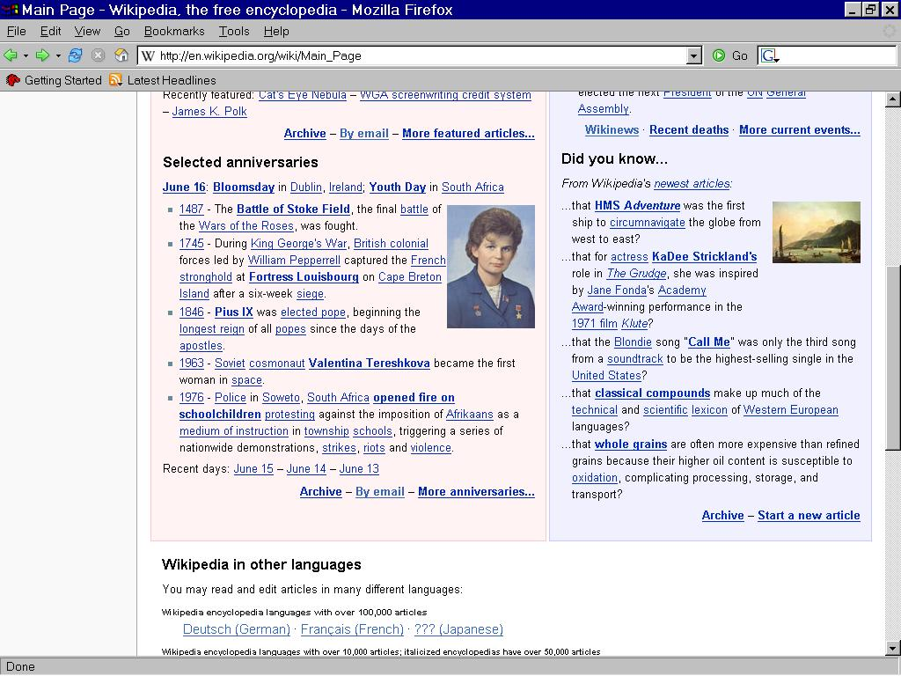
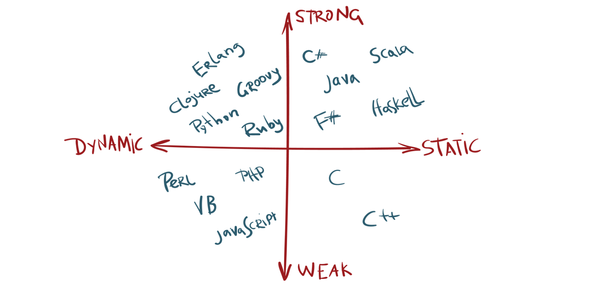
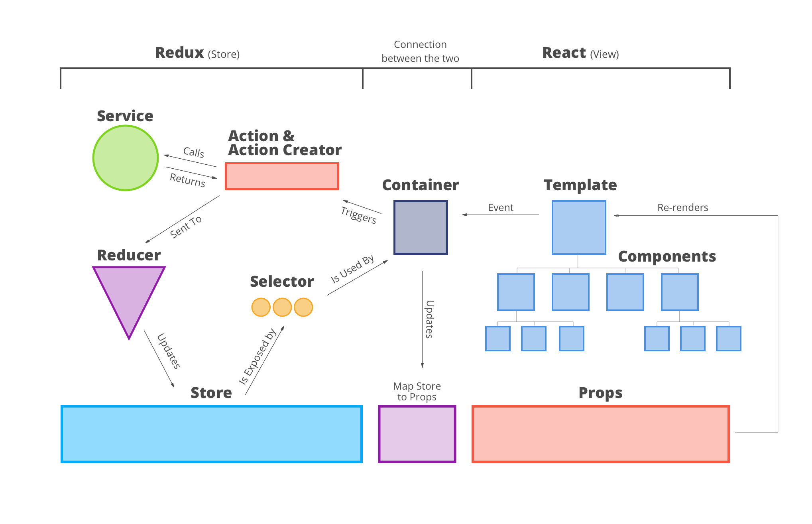

My mother used to tell me: "only fools never change their mind". Well, mother knows best, because I did it. Let's be honest here, who never made fun of JavaScript among the developers community? No one. There are so many funny jokes and memes about JavaScript, and most of them are part if not completely true. How did I miss for so long on the world's most used language?

> "JavaScript is the world's most misunderstood programming language."  
> <cite>— Douglas Crockford</cite>

This was probably my mistake, and a lot of people's as well. I was still learning and enjoying Java then C#, why would I need another language that is unsafe, random and inconsistent? Yeah... Time to talk about prejudices. The prejudices that kept me away from what we call "modern JavaScript" and its remarkable ecosystem.

### The hateful past: JS and prejudices

JavaScript is an old language, and you can't deny that, its first release dates back to 1995. I had a first contact with JavaScript during its jQuery era, so roughly 11 years after its release. As far as I know, it was a revolution and allowed interactivity in our websites.



And I surely remember the web slowly evolving from boring text & image pages to more dynamic and interactive pages.

##### A typed languages obsession

I learnt programming with Object Oriented and statically typed languages (read Java). I naturally got used to type everything, and work in a strongly typed environment: I knew what every variable was and what I could expect from any function, and that felt great.



Naturally, the first time I read JavaScript code, I panicked: "Where are the types?". It was literally impossible for me at the time to consider a language that would not declare the types it was using. I needed the safety (or at least the feeling of it) of typed variables.

##### Inconsistencies

_"If JavaScript is consistent at something, it's at being inconsistent"_. That was what i used to believe, literally. And i can tell I'm not the only one. If you don't try to understand why JavaScript is the way it is, lots of things might look weird, here are some math examples:

```js
[] + [] // -> ''
[] + {} // -> [object Object]
{} + [] // -> 0
```

I took those from the talk ["Wat", given by Gary Bernhardt at CodeMash 2012](https://www.destroyallsoftware.com/talks/wat). And while those can seem as weird as funny. They look like inconsistencies from a mathematical point of view. But there are explanation behind them, mostly residing in the fact that the `toPrimitive` and `toString` methods are called in the process. We just need to keep in mind that JavaScript's weak typing and coercion can lead to unexpected (and pretty funny) results...

##### Old JS, callback-hells and the likes

In the end, what kept me away from JavaScript for so long is probably the biased opinion I had, and my completely outdated vision of it. No further than in 2019, I was still thinking JavaScript was that clunky language people use to animate their website. When I heard the word JavaScript, this is the kind of thing that would have come through my mind:

```js:title=scary-callbacks.js
const verifyUser = function(username, password, callback) {
  dataBase.verifyUser(username, password, (error, userInfo) => {
    if (error) {
      callback(error);
    } else {
      dataBase.getRoles(username, (error, roles) => {
        if (error) {
          callback(error);
        } else {
          dataBase.logAccess(username, error => {
            if (error) {
              callback(error);
            } else {
              callback(null, userInfo, roles);
            }
          });
        }
      });
    }
  });
};
```

Scary, isn't it ? Well to me it was, and it still is. My error was thinking JavaScript was still stuck at this point...

### A brighter future: entering modern JavaScript era

While my work was mainly consisting of maintaining and developing new features on an Universal Windows Platform application (UWP) using C# and XAML, the main solution developed by the company was an ASP.NET backend serving a frontend written in VueJS. Because I got curious, and I knew that I'd had to eventually work on that, I asked to get involved in it. With no previous knowledge of JavaScript, I wanted to see if things changed. One thing surely changed: my state of mind regarding JS.

##### First contact with an unknown species called VueJs

That. Was. Hard. I mean overwhelming. Opening a complex solution, probably not perfectly implemented entreprise grade VueJs app, was maybe not the best thing I could have done to get into modern JavaScript. I took a step back, and decided to read some documentation. So I learnt some very basic JavaScript principles, and how VueJs is made. That was really intriguing, because what I was reading was JavaScript, but I felt like it was not the one I remembered. I was enjoying using VueJs. So I started implementing small features, and I ended up reading about the latest trends in the JS world. I immediately felt that i needed to try those, for the sake of knowledge and discovery, and simply curiosity.

##### The eye-opener: React

While reading about Vue, I came across numerous referees about a "framework" or "library" called React. Compared to the others, it often came out as "more mature" and "more popular". Without thinking twice, I was aready crawling through YouTube for some React knowledge, and I sure wasn't disappointed. The amount of complete but free resources is incredible. Going with the flow (pun slightly intended for whoever gets it), I followed up by implementing simple Redux stores to my app, and learnt by building a dummy ecommerce application. And it felt good, satisfying even. Because I enjoy well designed architecture, I had a great time implenting those as they felt like puzzle pieces that I put together.



React provided principles to abide by (see [thinking in React](https://reactjs.org/docs/thinking-in-react.html)) while Redux provided me with opinionated and "safe" way to handle requests and data in my application, how convenient! I will not go through everything I learnt because React is so complex, but it is still constantly evolving and growing and it definitely made me love JavaScript. Yes, you read that right.

##### Back to back(end): Express

I just witnessed modern Javascript power. And I was impressed. As someone with a prior experience consistent essentially of backend development and creating APIs, I wanted to see what Javascript had to offer. And boy, I was surely not disappointed when I looked at Express.

```js:title=express-server.js
// from expressjs.com

const express = require('express');
const app = express();
const port = 3000;

app.get('/', (req, res) => res.send('Hello World!'));

app.listen(port, () => console.log(`Example app listening on port ${port}!`));
```

Yup, that's 5 lines to run a web server. And as I dug deeper into Express, I realised the infinite possibilities it had to offer. I built a small app backend, used external APIs (such as Riot Games') and also worked with MongoDB. Everything was fast and efficient and felt satisfying. The `async/await` syntax made my fear of callback hells nothing but a bad memory. I was still missing something... types.

##### Do you even type ?

Well, yes I do! The moment I started working with TypeScript is the moment I put JavaScript at the top of the list of languages i enjoy working with. The little worry I had about encountering type errors on runtime and the annoyance of lacking auto-completion and "F12" navigation was gone. TypeScript feels like JavaScript on steroids. It was the icing on the cake. The simplicity and ease of getting an application running provided by JavaScript, with the power of types and all they involve, were in my hands.

> TypeScript is arguably one of the best things to come to the JavaScript world helping developers comfortably create complex enterprise software without anxiety.
> <cite>— Khalil Stemmler</cite>

"Comfortably" and "without anxiety" is exactly how i feel working with Typescript.
